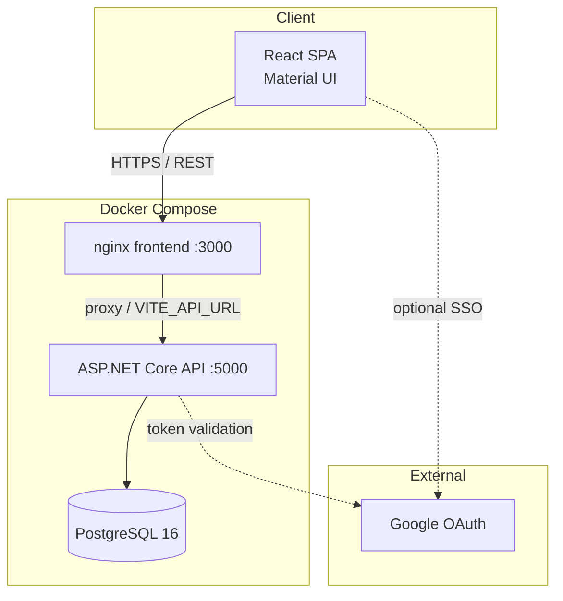
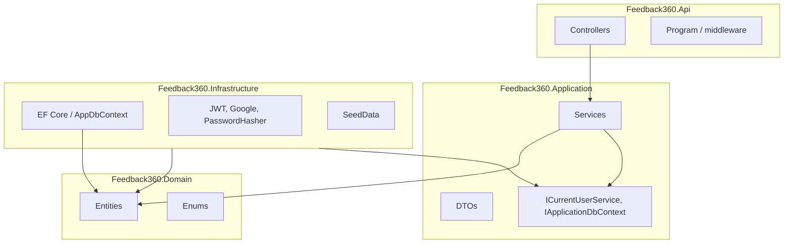
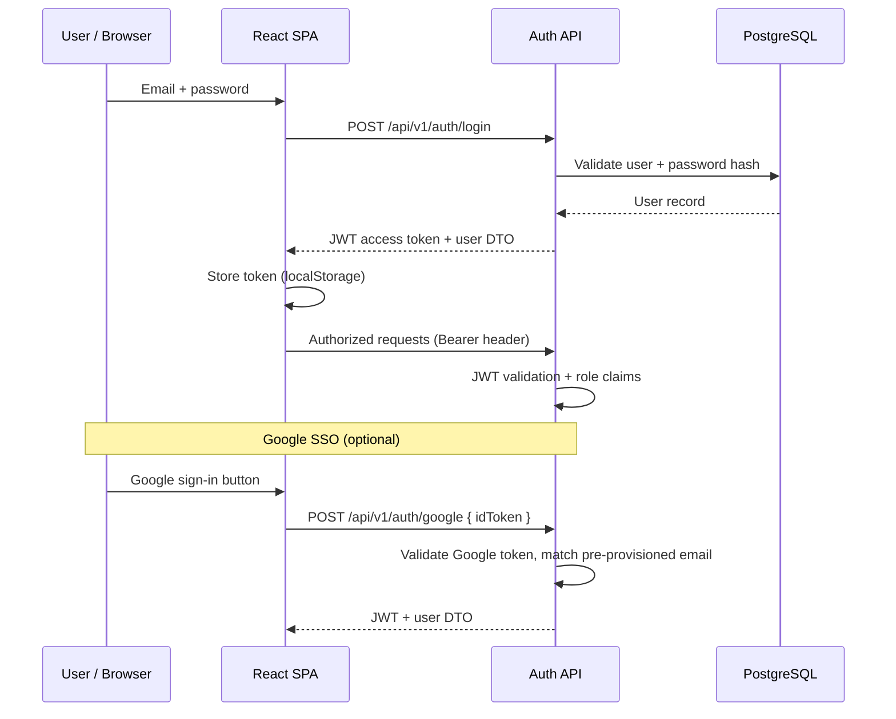
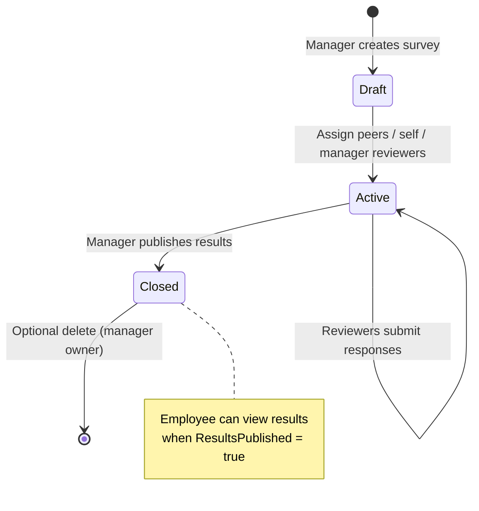
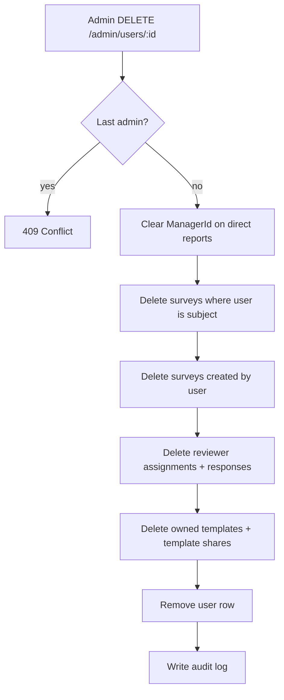
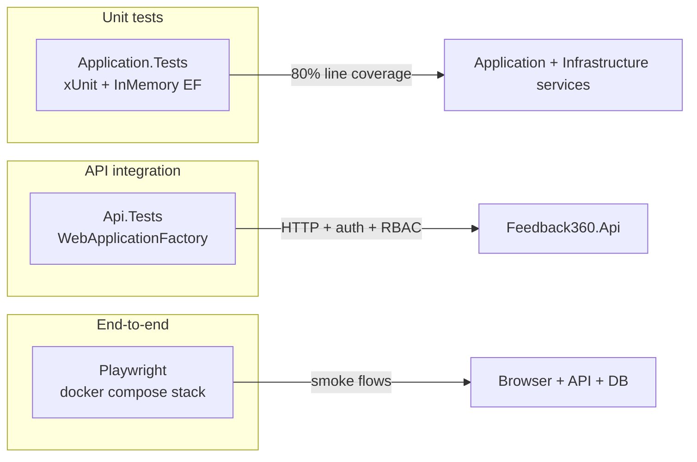

# Architecture

Feedback360 is a full-stack 360-degree feedback platform built with **Clean Architecture** on ASP.NET Core 8 and a React + TypeScript SPA.

## System overview



## Clean Architecture layers



| Layer | Responsibility |
|-------|----------------|
| **Domain** | Entities, enums, no dependencies |
| **Application** | Business logic, DTOs, service orchestration |
| **Infrastructure** | EF Core, auth, external integrations |
| **Api** | HTTP surface, Swagger, CORS, DI composition |

## Authentication flow



## RBAC matrix

| Capability | Admin | Manager | Employee |
|------------|:-----:|:-------:|:--------:|
| Manage users | ✓ | ✗ | ✗ |
| View audit logs | ✓ | ✗ | ✗ |
| Create/edit templates | ✗ | ✓ | ✗ |
| Create surveys & assign peers | ✗ | ✓ | ✗ |
| Respond to assignments | ✗ | ✓ | ✓ |
| View team results | ✗ | ✓ | ✗ |
| View own published results | ✗ | ✗ | ✓ |
| Access `/results` API | ✗ (403) | ✓ | ✓ (own only) |

Enforcement happens in two places:

1. **API** — `[Authorize(Roles = ...)]` on controllers plus service-level checks (e.g. admins blocked from results in `ResultsService`).
2. **Frontend** — route guards (`AdminOnly`, `ManagerOnly`, `ResultsViewer`) redirect unauthorized navigation.

## Survey lifecycle



Typical flow:

1. Manager builds or picks a **template** with categorized questions.
2. Manager launches a **survey** for a direct report.
3. **Assignments** are created for self, manager, and peer reviewers.
4. Reviewers complete responses via the assignments UI.
5. Manager **publishes results**; employee and manager can view charts and comments.

## User delete cascade

When an admin deletes a user, `UserService.DeleteAsync` runs a single transaction:



## Testing strategy



| Suite | Location | What it validates |
|-------|----------|-------------------|
| Application unit | `backend/tests/Feedback360.Application.Tests` | Service logic, edge cases, coverage gate |
| API integration | `backend/tests/Feedback360.Api.Tests` | Login, RBAC, categories, delete cascade, `/health` |
| E2E smoke | `e2e/tests` | Manager login, admin blocked from results, template CRUD UI |

## API reference

Interactive OpenAPI UI: `http://localhost:5000/swagger` (Development only).

To export the OpenAPI document locally:

```bash
cd backend/src/Feedback360.Api
dotnet run &
curl -s http://localhost:5000/swagger/v1/swagger.json -o ../../docs/swagger.json
```

See also the [API Overview](../README.md#api-overview) in the README.
